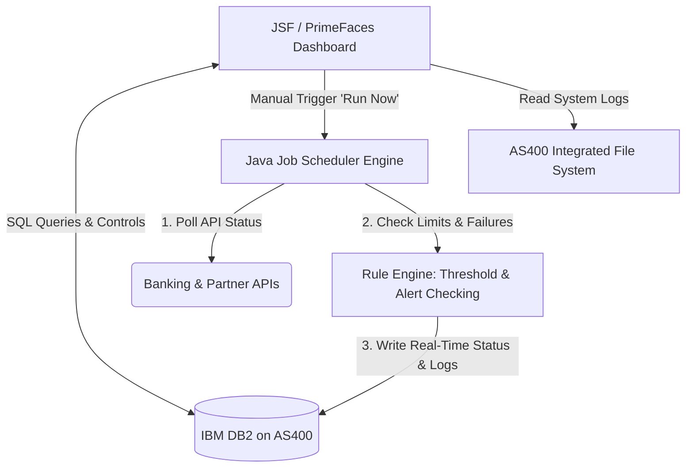

# 🖥️ Service Health Dashboard & API Monitoring System

## 🔒 Source Code Availability
> [!IMPORTANT]
> **Proprietary Software Notice**  
> This project is a proprietary enterprise application developed for a financial technology organization. Due to confidentiality, security, and non-disclosure agreements, the source code cannot be shared publicly. This repository serves as a portfolio showcase highlighting the system architecture, features, business impact, and my development responsibilities.

---

## 📋 Project Overview

This application is a **24/7 Service Health and API Monitoring Dashboard** built to monitor critical banking and transaction APIs in real time. 

Operating as a centralized hub, it enables operations teams to proactively track system health, catch operational failures, and execute manual fail-safe overrides before outages impact external clients.

I was responsible for the **end-to-end design and development** of this system, including database integrations, background scheduler mechanisms, alerting rule engines, and the web dashboard interface.

---

## 📈 System Architecture & Flow

The following diagram illustrates the relationship between the dashboard, Java scheduler service, legacy AS/400 database host, and target APIs:

---

## 🚀 Key Business Impact

- **Proactive Mitigation**: Shifted monitoring from reactive (waiting for customer complaints) to proactive detection.
- **Improved Recovery Times**: Reduced incident detection and response time for ops teams.
- **Enhanced System Uptime**: Real-time status polling and automated job retries minimized downstream API timeouts.
- **Operational Flexibility**: Allowed non-technical administrators to configure alert thresholds dynamically on the fly.

---

## ⚙️ Core Features & Technical Implementation

### 1. Real-Time Monitoring Engine
- Designed continuous health check workers with server-synced updates using PrimeFaces polling mechanisms.
- Displays live status indicators (healthy, warning, failed) depending on system state.

### 2. Alert & Rule Configuration
- Developed a backend rules processor that flags warning levels based on configurable operational limits:
  - `PENDING_LIMIT`: Queue backlogs.
  - `FAILURE_LIMIT`: Continuous HTTP response failure count.
  - `STATUS_QUERY`: Response timeout conditions.

### 3. Log Viewer (Legacy Integration)
- Implemented direct querying of large log datasets stored within the **AS/400 Integrated File System (IFS)** via SQL.
- Optimized rendering parameters to display large volumes of text in the UI without browser slowdowns.

### 4. Interactive Operations Control
- Created an interface to trigger jobs manually ("Run Now").
- Provided a management console for restarting or resyncing scheduler queues during API outages.

---

## 🛠️ Technology Stack

| Layer | Technology | Purpose |
| :--- | :--- | :--- |
| **Frontend UI** | JavaServer Faces (JSF) 2.x, PrimeFaces, CSS | Interactive widgets, polling, and data grid representation |
| **Backend Core** | Java, Enterprise Beans | Core monitoring logic, REST callers, and rules engines |
| **Database** | IBM DB2 / AS400 Integration | Relational table storage for configurations, states, and history |
| **Scheduling** | Custom Java Multi-threaded Scheduler | Executes periodic async polling jobs |

---

## 📄 License

This documentation and portfolio showcase outline are licensed under the MIT License.
